# 🤖 Happy Assistant

A friendly AI-powered **code teaching assistant** built using **Streamlit** and **Code Llama** (via Ollama API).  
Created by **Avinash** 💻

This app helps you interact with your local or remote LLM API (like `http://localhost:11434/api/generate`) in a clean, chat-like UI.  
You can control **temperature**, **model name**, and review **conversation history** easily.

---

## 🌟 Features

- 🧠 Chat-based interaction with your local LLM API  
- ⚙️ Adjustable **temperature** and **model name**  
- 💬 Keeps a full chat history in session  
- 🚀 Fast, lightweight, and easy to run  
- 🎨 Streamlit UI designed for wide-screen displays  

---
## 🏗️ Project Flow (Mermaid Diagram)

```mermaid
graph TD
    A[Start] --> B(1️⃣ Launch Streamlit App)
    B --> C{User Provides Prompt?}
    C -- Yes --> D[Append Prompt to History]
    D --> E(Send POST Request to API)
    E --> F{Response Received?}
    F -- ✅ Yes --> G(Display AI Response)
    G --> H[Append Response to History]
    H --> I(Show Conversation History if Enabled)
    F -- ❌ No --> J(Display Connection/Error Message)
    I --> K[End]
    J --> K

    subgraph "💡 Settings & Configuration"
        L[Set Temperature via Sidebar Slider]
        M[Enter Model Name]
        L --> E
        M --> E
    end

    subgraph "🖥️ API Backend"
        E --> N[Local Ollama API or Remote Endpoint]
        N --> O{Model Loaded?}
        O -- Yes --> P[Generate Text]
        P --> F
        O -- No --> J
    end
```

## Setup & Installation
1. Clone the Repository
git clone https://github.com/Avinashabilash/happy-assistant.git
cd happy-assistant

## | Parameter        | Description                                          | Default                               |
   | ---------------- | ---------------------------------------------------- | ------------------------------------- |
   | **Model Name**   | Name of the LLM model you want to use (Ollama model) | `codehappy:7b`                        |
   | **Temperature**  | Controls randomness in generation (0.0 - 2.0)        | `1.0`                                 |
   | **API Endpoint** | Local or remote LLM API URL                          | `http://localhost:11434/api/generate` |

## 🧩Example Output
🧑‍💻 You: Write a Python function to reverse a string
🤖 Happy: Sure! Here’s a simple example:

def reverse_string(s):
    return s[::-1]

    
## UI Preview 

